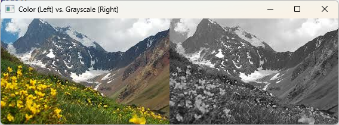

# CUDA Grayscale Conversion

This project demonstrates how to use CUDA to accelerate the conversion of a color image to grayscale. By leveraging the parallel processing power of the GPU, we can achieve significant performance improvements compared to a traditional CPU-based approach.

## Code Overview

The `kernel.cu` file contains the CUDA code for this project. Here's a breakdown of the main components:

* **grayscaleKernel**: This is the CUDA kernel function that performs the grayscale conversion for each pixel. It takes the input image, width, and height as parameters. For each pixel, it calculates the grayscale value using the formula `0.2126 * red + 0.7152 * green + 0.0722 * blue` and assigns the calculated value to the red, green, and blue channels of the pixel, effectively converting it to grayscale.

* **main**: This function loads the image, allocates memory on the GPU, copies the image data to the GPU, launches the `grayscaleKernel`, copies the processed image back to the host, and measures the execution time.

## CUDA Concepts

* **Kernel**: A kernel is a function that runs on the GPU. In this project, the `grayscaleKernel` is the kernel function.

* **Grid and Block**: The GPU's threads are organized into a grid of blocks. Each block contains a set of threads. The `grayscaleKernel` is launched with a grid and block configuration that matches the image dimensions, allowing for efficient parallel processing of the image.

* **Memory Management**: The code allocates memory on the GPU using `cudaMalloc`, copies data from the host to the device using `cudaMemcpyHostToDevice`, and copies data back from the device to the host using `cudaMemcpyDeviceToHost`.

## Performance

The GPU implementation provides a significant speedup compared to a CPU-based implementation, especially for larger images. This is because the GPU can process many pixels in parallel, while the CPU can only process a few pixels at a time.

## How to Run

1.  Make sure you have a CUDA-enabled GPU and the CUDA toolkit installed.
2.  Compile the code using a CUDA compiler (e.g., `nvcc`).
3.  Run the executable.

This will generate a grayscale version of the input image and display the processing time.

## Example

